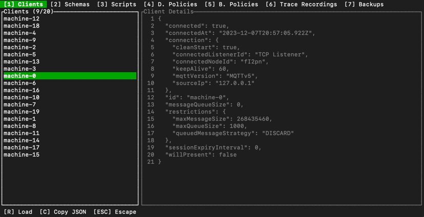

# hmq-tui


hmq-tui sets out to give easy access to [HiveMQ  REST API](https://docs.hivemq.com/hivemq/4.21/rest-api/specification/).

Simply use the `hmq` command to start the TUI:
```
hmq
```

## Setup

### MacOs (Homebrew)
```bash
brew install gitseti/hmq-tui/hmq-tui
```

### Windows

### x86_64

[Download](https://github.com/gitseti/hmq-tui/releases/download/0.1.0/hmq-tui-0.1.0-x86_64-pc-windows-msvc.zip)

### Arm64
[Download](https://github.com/gitseti/hmq-tui/releases/download/0.1.0/hmq-tui-0.1.0-aarch64-pc-windows-msvc.zip)
### Linux (Deb)

#### x86_64
```bash
wget https://github.com/gitseti/hmq-tui/releases/download/0.1.0/hmq-tui-0.1.0-x86_64-unknown-linux-gnu.deb
udo apt install ./hmq-tui-0.1.0-x86_64-unknown-linux-gnu.deb
```

#### Arm64
```bash
wget https://github.com/gitseti/hmq-tui/releases/download/0.1.0/hmq-tui-0.1.0-aarch64-unknown-linux-gnu.deb
udo apt install ./hmq-tui-0.1.0-aarch64-unknown-linux-gnu.deb
```


### Linux (RPM)

#### x86_64
```bash
sudo yum install -y https://github.com/gitseti/hmq-tui/releases/download/0.1.0/hmq-tui-0.1.0-x86_64-unknown-linux-gnu.rpm
```

#### Arm64
```bash
sudo yum install -y https://github.com/gitseti/hmq-tui/releases/download/0.1.0/hmq-tui-0.1.0-aarch64-unknown-linux-gnu.rpm
```
