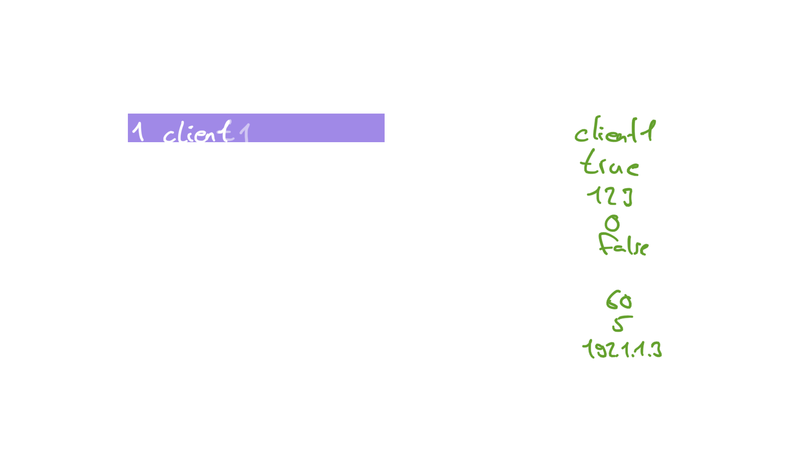

# Goals
hmq-tui sets out to give easy access to [HiveMQ  REST API](https://docs.hivemq.com/hivemq/4.21/rest-api/specification/).

```
hmq-tui -h localhost:8888
```


# Libaries
[ratatui](https://github.com/ratatui-org/ratatui)
[openapi-generator](https://github.com/OpenAPITools/openapi-generator/blob/master/docs/generators/rust.md)

# Setup

Generate REST API client code (requires `openapi-generator`):
```
cd hivemq-openapi
openapi-generator generate -i hivemq-4.21.0-openapi.yaml -g rust --additional-properties=useSingleRequestParameter=true
```

To start up HiveMQ with a running REST API in order to test the tui use the following command:
```
docker run --env HIVEMQ_REST_API_ENABLED=true --ulimit nofile=500000:500000 -p 8080:8080 -p 8000:8000 -p 1883:1883 -p 8888:8888 hivemq/hivemq4
```

# Milestones

- [ ] Retrieve a snapshot of all available clients
- [ ] Retrieve the client details of a given client id
- [ ] Have a expendable UI mock for the TUI
- [ ] Implement the TUI frontend & wire in the REST API calls
- [ ] Design and implement CLI options
- [ ] CI/CD the TUI
